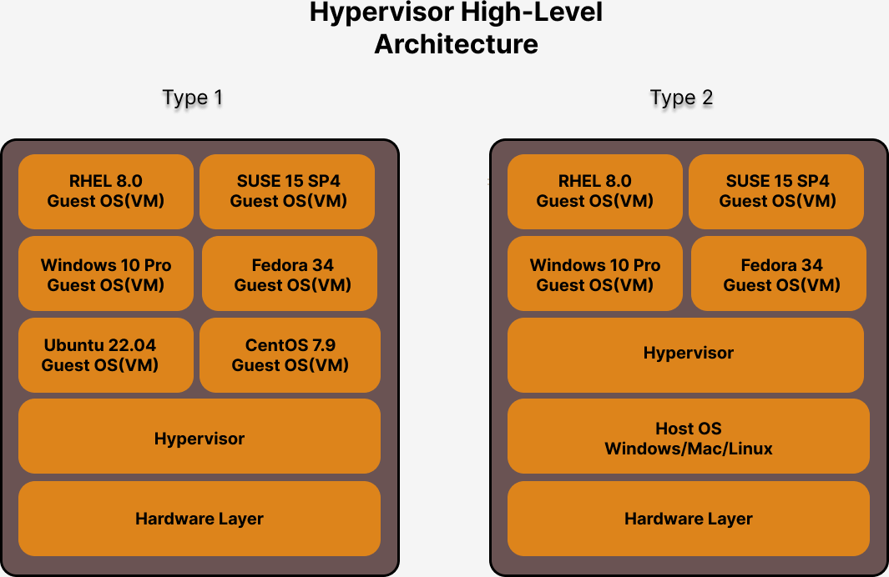
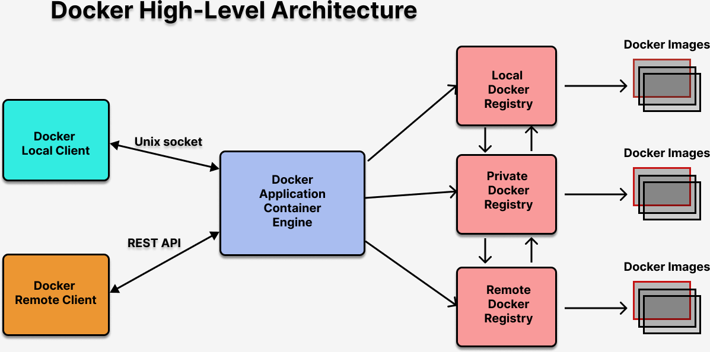
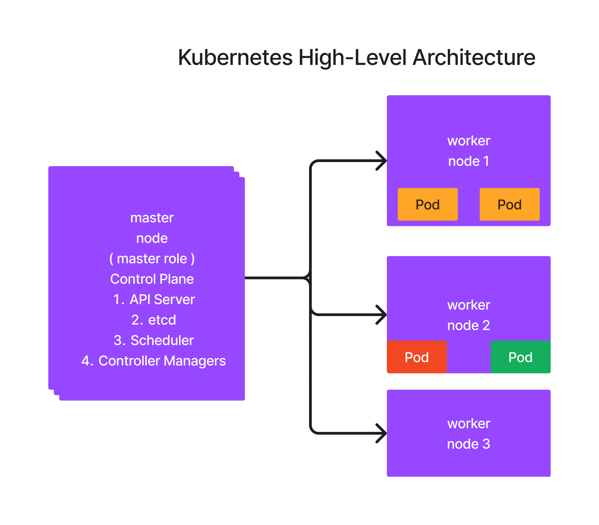

# Day 1 ( 4 Hours )

## What is Hypervisor ?
- is a technical term that reffs to the Virtualization Technology
- allows running many Operating Systems side by side on the same Desktop/Laptop/Workstation/Server
- many OS can actively run on the same machine
- Processors
  - Intel Processor - Virtualization feature - VT-X
  - AMD Processor - Virtualization feature - AMD-V
- there are two types 
  1. Type 1 - Bare Metal Hypervisor ( VMWare vSphere/V-Center )
  2. Type 2 - VMWare Workstation, VMWare Fusion(Mac), Oracle VirtualBox, Microsoft Hyper-V
- Type 1 is used in Servers/Workstations ( This doesn't require Host OS )
- Type 2 is used in Laptop/Desktop/Workstations ( This requires Host OS )
- This type of Virtualization is called Heavy-weight Virtualization
  Each VM(Guest OS) are allocated with dedicated 
    - Hardware resources ( CPU, RAM and Hard Disk[Storage] )

## Hypervisor High Level Architecture

## What are Containers ?
- this is an application virtualization technology
- lightweight virtualization technology
- based on Linux Kernel Feature
  1. Namespace - used to isolate one container from other container
  2. Control Group (CGroups) - used to apply resource quota restrictions on a container-level
- each containers runs one application

## How Containers are different from Virtual Machines ?
- Virtual Machines are aka Guest OS
- VMs are fully function Operating System with dedicated hardwares
- Guest OS has its own dedicated OS Kernel
- Containers are application process that runs in a separate namespace
- Containers are not Operating System, it just represents a single application
- Guest OS can run many application process including many containers
- Container are never going to replace Virtual Machines, they complement each other

## What is Container Runtime ?
- Examples
  runC is a container Runtime
  CRI-O is a container Runtime
- Container Runtimes help us manage containers
  - creating containers
  - listing containers
  - deleting containers
  - modifying containers
  - killing/aborting containers
  - stop/start/restarting containers
- Container Runtimes are used by Container Engines to manage containers

## What is Container Engine ?
- Container Engine provides user-friendly commands to use create and manage containers and container images without worrying about low-level OS Kernel/Container technology details
- end-users use Container Engine
- Docker depends on runC Container Runtime to manage containers
- Docker also depends on other tools to manage Container Images
- Examples
  - Docker
  - Podman

## Docker High Level Architecture 

## What is Container Orchestration Platform ?
- helps in managing containerized applications
- main features supported by Container Orchestration Platforms
  - manage containerized applications
  - application monitoring and self-heling
  - scale up/down on demand
  - rolling update
    - upgrading your live application from one version to other without any downtime
  - application connectivity using Service(Service Discovery)
  - security
  - High Availability (HA)
  - access management
  
- Examples of Orchestration Platforms
  - Docker SWARM - supports only native Docker containerized applications
  - Kubernetes - it supports many container runtimes that supports CRI (Container Runtime Interface)
  - Red Hat OpenShift - Red Hat's Distribution of Kubernetes

- AWS Kubernetes Service ( EKS - Managed Service )
  - Azure Kubernetes Service ( AKS - Managed Service )
  - AWS ROSA ( RedHat OpenShift - Managed service )
  - Azure ARO ( Azure Red Hat OpenShift - Managed Service )
- Examples of Containerized Applications
  - Microservices are containerized application
  - REST/SOAP APIs can be containerized
  - DB Servers like mysql, oracle, mongo db, cassandra, couchbase, redis can be containerized
  - Web Server can be containerized
  - Application Servers can be containerized

## What is Kubernetes ?
- is a Container Orchestration Platform developed by Google as open source project in Go programming language
- is a production-grade orchestration platform 
- this was within Google for many year before it was made an open-source, hence it is time-test robust platform
- works a cluster of nodes
- node could be a Virtual Machine/Physical Server/Cloud virtual machine
- aka k8s
- there are two types of nodes
  1. Master node
  2. Worker node
- supports extending Kubernetes API by adding your own custom operators
- Operators
  - is a combination of CRDs(Custom Resource Defintion) and Customer Controllers
  
#### Kubernetes Master Node
- Control Plane
  - set of components that only runs on a Master Node
  - these components supports the Kubernetes Orchestration Functionalities
  - API Server
  - Scheduler
  - etcd key/value data store
  - Controller Managers

#### Kubernetes Worker Node
- is where user containerized applications are deployed and runs

#### API Server
- supports Kubernetes functionalities as REST APIs
- this is core component of Kubernetes 
- this component stores the Cluster and application state in the etcd key-value data-store
- etcd is accessed only by API Server
- API server triggers events whenever something is created, updated or deleted in etcd database
- every K8s components only talks to API Server

#### etcd
- key/value datastore used by API Server
- this stores the cluster and application state

#### Scheduler
- this is the component which identifies a healthy node where new Pods(application) can be deployed
- Scheduler shares the scheduling recommendations to API Server via REST call

#### Controller Managers
- is a combination of many Controllers
- For example
  - Deployment Controller to manage Deployment
  - ReplicaSet Controller to manage ReplicaSets
  - Job Controller to manage Jobs
  - EndPoint Controller to manage service Pod endpoints
  - DaemonSet Controller to manage DaemonSet
 
#### What is a Kubernetes Controller ?
- each controller monitors and manages a specific type of Kubernetes Resource/Object
- Deployment Controller manages Deployment 
  - Deployment Controller keeps watching for the below events
    - when new Deployment is created
    - When existing Deployment is updated
    - When existing Deployment is deleted
    - when deployments are scaled up/down
    - when deployment - rolling update happens
    - when deployment - roll back happens
 
## Commonly used Kuberentes Resources/Objects
1. Pod ( Resource Definitions stored in etcd )
   - a group of related containers
   - each Pod represents one application
   - though a Pod can have multiple containers, recommended best practice says one main application per Pod
   - all the containers in a Pod they share the network( network stack, IP Address, ports, etc .,)
   - managed by ReplicaSet Controller
2. ReplicaSet ( Resource Definition stored in etcd )
   - Application Pods that belongs to specific Deployment are managed by a ReplicaSet
   - each ReplicaSet manages one or more Pods
   - supports scaling up/down your Pod instances
   - is created by Deploymenent Controller
   - managed by ReplicaSet Controller
3. Deployment ( Resource definition stored in etcd )
   - this is how deploy our applications into the Kubernetes cluster
   - each Deployment has one or more ReplicaSet
   - supports rolling update when you wish to upgrade your live applications from one version to other version
   - supports rolling back when you wish to go back to older version of your application in case of some issue in latest version
   - is Managed by Deployment Controller

## What is Custom Resource Defintion (CRD) ?
- You can add your own type of Kubernetes resources/objects into the Kubernetes Cluster
- This is one could extend the Kubernetes features(api)
- To manage your Custom Resource(CR) you need to develop/deploy a Custom Controller
- Combination of one or more Custom Resource Defintions(CRDs) and Custom Controller is called an Operator

## What is Kubernetes Operators
- is a comibination of many CRDs + Custom Controllers

## Kubernetes High-Level Architecture

## What is OpenShift ?
- OpenShift is RedHat's distribution of Kubernetes
- Openshift is developed on top of Kubernetes with many additional features
- OpenShift added many additional features using the Kubernetes Operators
- Openshift => Kubernetes + Many Custom Kubernetes Operators

## OpenShift High-Level Architecture

- Master Node
  - RedHat OpenShift supports only Red Hat Enterprise Core OS as the Operating System
- Worker Node
  - RedHat OpenShift supports either Red Hat Enterprise Linux(RHEL) or Red Hat Enterprise Core OS as the Operating System
- Best Practice - use Red Hat Enterprise Core OS for both master and worker nodes
- If Red Hat Enterprise Core OS is used it is easy to upgrade the use using openshift commands
- Red Hat Enterprise Core OS is an OS optimized for Container Orchestration Platform like OpenShift
- Red Hat Enterprise Core OS comes with pre-installed CRI-O Container Runtime and Podman Container Engine
- Red Hat Enterprise Core OS enforces many Best Practices 
   - running application as root isn't recommended, normally won't work
   - use ports below 1000 are prohibited 
- Openshift enforces deploying application within a project(is nothing but namespace)

